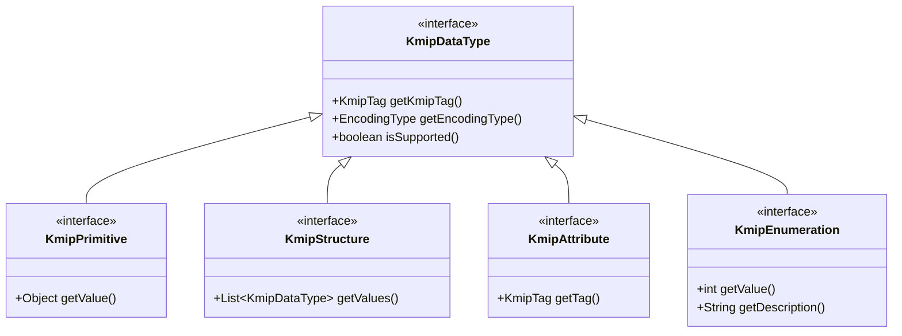

# Core Architecture

This document outlines the fundamental concepts and architecture of the PurpleBean KMIP Adapter, providing a comprehensive guide to understanding its design and implementation.

## Type System

The KMIP Adapter implements a robust type system that maps to KMIP data types, ensuring type safety and protocol compliance:

### Core Type Hierarchy



### Type Categories

1. **Primitive Types**
   - Basic data types: `Integer`, `Long`, `String`, `Boolean`, `ByteString`
   - Temporal types: `DateTime`, `Interval`
   - Cryptographic types: `Digest`, `Signature`

2. **Structured Types**
   - Implement `KmipStructure` interface
   - Examples: `FooStructure`, `ProtocolVersion`, `SimpleRequestMessage`
   - Can contain nested KMIP data types
   - Use builder pattern with validation

3. **Enumerations**
   - Type-safe enums implementing `KmipEnumeration`
   - Examples: `FooEnum`, `State`, `CryptographicAlgorithm`, `Operation`
   - Support extension values and custom registrations
   - Thread-safe value registries

4. **Data Types**
   - Simple data wrappers implementing `KmipDataType`
   - Examples: `FooDataType`, `ActivationDate`, `ObjectType`
   - Immutable design with static factory methods
   - Support for various encoding types

## Core Interfaces

### `KmipDataType`
Base interface for all KMIP data types with methods for tag, encoding, and version support:

```java
public interface KmipDataType {
    /**
     * Returns the KMIP tag for this data type
     */
    KmipTag getKmipTag();
    
    /**
     * Returns the encoding type for this data type
     */
    EncodingType getEncodingType();
    
    /**
     * Checks if this type is supported for the current KMIP specification
     */
    boolean isSupported();
}
```

### `KmipContext`
Thread-local context for KMIP operations. Use static methods to manage the spec per thread:

```java
// Set the KMIP spec for the current thread
KmipContext.setSpec(KmipSpec.V1_2);

try {
    // Perform operations that depend on the KMIP spec...
} finally {
    // Always clear the context when finished
    KmipContext.clear();
}
```

## Serialization Framework

The KMIP Adapter provides a flexible serialization framework with support for multiple formats:

### Supported Formats

1. **TTLV (Tag-Type-Length-Value)**
   - Native KMIP binary format
   - High performance, compact representation
   - Used for KMIP protocol communication

2. **JSON**
   - Human-readable format for web APIs
   - Easy integration with web services
   - Supports pretty-printing for debugging

3. **XML**
   - Standard XML representation
   - Suitable for XML-based integrations
   - Supports schema validation

### Serialization Features

- **Type Safety**: Compile-time type checking
- **Version Awareness**: Automatic handling of version-specific behavior
- **Extensibility**: Support for custom types and serializers
- **Performance**: Optimized for high-throughput scenarios
- **Error Handling**: Comprehensive error reporting and recovery

## Thread Safety

The KMIP Adapter is designed with thread safety in mind:

- **Immutable Objects**: All data objects are immutable
- **Thread-Local Context**: `KmipContext` maintains state per thread
- **Stateless Serializers**: Serializers are thread-safe after construction
- **No Shared Mutable State**: Core components are designed to avoid shared state

## Versioning

The adapter supports multiple KMIP specification versions with the following features:

- **Version-Specific Behavior**: `KmipSpec` class defines version-specific behavior
- **Backward Compatibility**: Maintains compatibility with older versions where possible
- **Feature Detection**: Runtime checks for version support
- **Graceful Degradation**: Falls back to supported features when possible

## Error Handling

Comprehensive error handling with specialized exception types:

- `KmipSerializationException`: Serialization/deserialization failures
- `KmipValidationException`: Data validation failures
- `KmipVersionException`: Version compatibility issues
- `KmipOperationException`: General operation failures

## Extension Points

The KMIP Adapter is designed for extensibility:

1. **Custom Types**
   - Implement core interfaces for new KMIP types
   - Register custom type handlers
   - Support for vendor-specific extensions

2. **Custom Serialization**
   - Extend base serializers/deserializers
   - Add support for custom formats
   - Implement custom type adapters

3. **Version Support**
   - Add support for new KMIP versions
   - Implement version-specific behavior
   - Contribute to the open-source project
