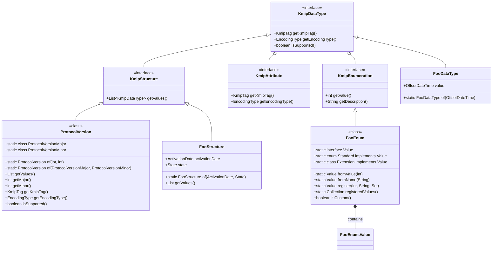

# KMIP Type System

## Overview

The KMIP Adapter implements a robust, type-safe type system that provides comprehensive support for all KMIP data types. The type system is designed to be:

- **Type-Safe**: Compile-time checking of KMIP types and operations
- **Extensible**: Easy to add custom types and behaviors
- **Version-Aware**: Full support for KMIP specification versions
- **Thread-Safe**: Immutable data structures for concurrent access
- **Validating**: Built-in validation of KMIP constraints

## Core Type Hierarchy



## Core Types

### 1. Primitive Types

| Type | Java Class | Description | Example |
|------|------------|-------------|---------|
| Integer | `Integer`, `Long` | Signed integer values | `42`, `0x2A` |
| String | `String` | UTF-8 encoded text | `"KMIP Server"` |
| Byte String | `byte[]`, `ByteBuffer` | Raw binary data | `[0x01, 0x02, 0x03]` |
| Boolean | `Boolean` | True/False value | `true`, `false` |
| DateTime | `OffsetDateTime` | Timestamp with timezone | `2023-01-01T12:00:00Z` |
| Interval | `Duration` | Time duration | `PT1H30M` (1 hour 30 minutes) |

### 2. Structured Types

#### Enumerations
The `State` type in this project is a class implementing `KmipEnumeration` with a nested `Standard` enum and registry-based lookup. Construct it like this and use the `KmipSpec`-aware lookup methods:

```java
// Set the KMIP spec before using State
KmipContext.setSpec(KmipSpec.V1_4);
try {
    // Create a state using standard value
    State state = new State(State.Standard.ACTIVE);
    
    // Lookup by value with spec awareness
    State.Value activeState = State.fromValue(KmipSpec.V1_4, 0x00000002);
    
    // Lookup by name with spec awareness
    State.Value activeByName = State.fromName(KmipSpec.V1_4, "Active");
    
    // Register a custom state
    State.Value customState = State.register(0x80000001, "CustomState", Set.of(KmipSpec.UnknownVersion, KmipSpec.V1_4));
    
    // Get all registered custom states
    Collection<State.Value> customStates = State.registeredValues();
    
    // Check if a state is custom
    boolean isCustom = state.isCustom();
} finally {
    KmipContext.clear();
}
```

#### Attributes
Specialized types implementing `KmipAttribute`:

```java
/**
 * Represents the Activation Date attribute.
 */
@Data
@Builder
public class ActivationDateAttribute implements KmipAttribute {
    @NonNull
    private final OffsetDateTime dateTime;

    @Override
    public KmipTag getKmipTag() {
        return new KmipTag(KmipTag.Standard.ACTIVATION_DATE);
    }
    
    @Override
    public EncodingType getEncodingType() {
        return EncodingType.DATE_TIME;
    }
}
```

#### Structures
Complex types implementing `KmipStructure`:

```java
/**
 * Represents a KMIP Protocol Version.
 */
@Data
@Builder
public class ProtocolVersion implements KmipStructure {
    @NonNull
    private final ProtocolVersionMajor protocolVersionMajor;
    
    @NonNull
    private final ProtocolVersionMinor protocolVersionMinor;

    @Override
    public KmipTag getKmipTag() {
        return new KmipTag(KmipTag.Standard.PROTOCOL_VERSION);
    }
    
    @Override
    public EncodingType getEncodingType() {
        return EncodingType.STRUCTURE;
    }
    
    // Create a protocol version
    public static ProtocolVersion of(int major, int minor) {
        return ProtocolVersion.builder()
            .protocolVersionMajor(ProtocolVersionMajor.of(major))
            .protocolVersionMinor(ProtocolVersionMinor.of(minor))
            .build();
    }
    
    // Get major/minor versions
    public int getMajor() {
        return protocolVersionMajor.getValue();
    }
    
    public int getMinor() {
        return protocolVersionMinor.getValue();
    }
    
    // Or access the inner objects directly
    public int getMajorValue() {
        return protocolVersionMajor.getValue();
    }
    
    public int getMinorValue() {
        return protocolVersionMinor.getValue();
    }
    
    // Check version support
    public boolean isSupportedFor(KmipSpec spec) {
        return protocolVersionMajor.isSupportedFor(spec) && protocolVersionMinor.isSupportedFor(spec);
    }
    
    // Create from individual components
    public static ProtocolVersion of(ProtocolVersionMajor major, ProtocolVersionMinor minor) {
        return ProtocolVersion.builder()
            .protocolVersionMajor(major)
            .protocolVersionMinor(minor)
            .build();
    }
    
    // Get all values as KMIP data types
    public List<KmipDataType> getValues() {
        return Arrays.asList(protocolVersionMajor, protocolVersionMinor);
    }
}
```

## Type Safety Features

### 1. Compile-time Safety

- **Strong Typing**: All KMIP types are represented by dedicated Java classes
- **Immutability**: All types are immutable after construction
- **Builder Pattern**: Complex objects use builders for safe construction
- **Null Safety**: `@NonNull` annotations enforce non-null constraints

### 2. Runtime Validation

- **Input Validation**: All inputs are validated during construction
- **Version Checking**: Operations verify version compatibility
- **Constraint Validation**: Enforces KMIP-specific constraints
- **Error Messages**: Detailed error messages for debugging

### 3. Version Support

- **Version-Specific Behavior**: Types can implement version-specific logic
- **Feature Detection**: Check feature support at runtime
- **Graceful Degradation**: Fall back to supported features when possible

## Best Practices

### 1. Creating New Types

```java
/**
 * Example of creating a new KMIP attribute.
 */
@Value
@Builder
public class CustomAttribute implements KmipAttribute {
    public static final int CUSTOM_TAG = 0x540001;
    
    @NonNull
    private final String value;
    
    @Override
    public KmipTag getTag() {
        return new KmipTag(CUSTOM_TAG, "CustomAttribute", "Custom attribute example");
    }
    
    @Override
    public EncodingType getEncodingType() {
        return EncodingType.TEXT_STRING;
    }
}
```

### 2. Working with Enums

```java
// Create a State using a standard value
State state = new State(State.Standard.ACTIVE);

// Convert to/from integer values using a KMIP spec
int code = State.Standard.ACTIVE.getValue();
State.Value lookedUp = State.fromValue(KmipSpec.V1_2, code);
```

### 3. Validation Example

```java
// ActivationDate validation patterns
ActivationDateAttribute attr = ActivationDateAttribute.builder()
    .dateTime(OffsetDateTime.now(ZoneOffset.UTC))
    .build();

// Example: equals/hashCode normalize to seconds (see implementation)
```

## Common Patterns

### 1. Type Conversion

```java
// Convert ActivationDate to/from TTLV using TtlvMapper
TtlvMapper ttlv = new TtlvMapper();
ttlv.registerModule(new KmipTtlvModule());
byte[] bytes = ttlv.writeValueAsBytes(attr);
ActivationDateAttribute decoded = ttlv.readValue(bytes, ActivationDateAttribute.class);
```

### 2. Working with Collections

```java
// Create a list of KMIP attributes
List<KmipAttribute> attributes = Arrays.asList(
    new ActivationDateAttribute(OffsetDateTime.now()),
    new CustomAttribute("example")
);

// Filter attributes by type
List<ActivationDateAttribute> dateAttributes = attributes.stream()
    .filter(ActivationDateAttribute.class::isInstance)
    .map(ActivationDateAttribute.class::cast)
    .collect(Collectors.toList());
```

### 3. Error Handling

```java
try {
    // Perform KMIP operation
    KeyBlock keyBlock = createKeyBlock();
    keyBlock.validate();  // Explicit validation
    
    // Serialize with version checking
    if (keyBlock.isSupportedFor(KmipSpec.V1_4)) {
        byte[] data = ttlvMapper.writeValueAsBytes(keyBlock);
        // Process data...
    }
} catch (KmipValidationException e) {
    // Handle validation errors
    logger.error("Validation failed: {}", e.getMessage());
    throw new BusinessException("Invalid key block: " + e.getMessage(), e);
} catch (KmipVersionException e) {
    // Handle version compatibility issues
    logger.warn("Version mismatch: {}", e.getMessage());
    // Fall back to compatible version or report error
}
}
```

## Extending the Type System

### Creating Custom Types
1. Implement `KmipDataType` for new primitive types
2. Extend `KmipStructure` for complex types
3. Implement `KmipEnumeration` for new enums

### Custom Serialization
1. Create custom serializers/deserializers
2. Register with the appropriate module
3. Handle version compatibility

## Primitive Types

| Type | Description | Example | KMIP Tag | Java Type |
|------|-------------|---------|----------|-----------|
| `Integer` | 32-bit signed integer | `42` | `Integer` | `int`/`Integer` |
| `Long` | 64-bit signed integer | `1234567890L` | `LongInteger` | `long`/`Long` |
| `BigInteger` | Arbitrary-precision integer | `new BigInteger("12345678901234567890")` | `BigInteger` | `java.math.BigInteger` |
| `String` | UTF-8 encoded string | `"example"` | `TextString` | `java.lang.String` |
| `Boolean` | Boolean value | `true` | `Boolean` | `boolean`/`Boolean` |
| `byte[]` | Binary data | `new byte[] {0x01, 0x02, 0x03}` | `ByteString` | `byte[]` |
| `OffsetDateTime` | Date and time with offset | `OffsetDateTime.now()` | `DateTime` | `java.time.OffsetDateTime` |
| `ProtocolVersion` | KMIP protocol version | `ProtocolVersion.of(1, 2)` | `ProtocolVersion` | `org.purpleBean.kmip.ProtocolVersion` |

## Enumerations

KMIP enums are implemented as type-safe classes implementing `KmipEnumeration` with the following features:

1. **Standard Values**: Predefined enum constants
2. **Type Safety**: Compile-time type checking
3. **Lookup**: Thread-safe registration and lookup by value or description
4. **Serialization**: Built-in support for JSON, XML, and TTLV formats

### Example: State Enumeration

```java
/**
 * Represents the state of a cryptographic object in KMIP.
 */
public enum State implements KmipEnumeration {
    PRE_ACTIVE(0x00000001, "PreActive"),
    ACTIVE(0x00000002, "Active"),
    DEACTIVATED(0x00000003, "Deactivated"),
    COMPROMISED(0x00000004, "Compromised"),
    DESTROYED(0x00000005, "Destroyed"),
    DESTROYED_COMPROMISED(0x00000006, "Destroyed Compromised");

    private final int value;
    private final String description;

    State(int value, String description) {
        this.value = value;
        this.description = description;
    }

    @Override
    public int getValue() {
        return value;
    }

    @Override
    public String getDescription() {
        return description;
    }

    /**
     * Lookup a State by its integer value.
     */
    public static State fromValue(int value) {
        return Arrays.stream(values())
            .filter(s -> s.value == value)
            .findFirst()
            .orElseThrow(() -> new IllegalArgumentException("Invalid State value: " + value));
    }
}
```

## Structures

KMIP structures represent complex data types composed of multiple fields. They implement the `KmipStructure` interface and are typically used for request/response messages, headers, and other composite types.

### Example: Request Message Structure

```java
/**
 * Represents a KMIP request message.
 */
public class RequestMessageStructure implements KmipStructure {
    private final RequestHeaderStructure header;
    private final List<RequestBatchItemStructure> batchItems;

    public RequestMessageStructure(RequestHeaderStructure header, 
                                 List<RequestBatchItemStructure> batchItems) {
        this.header = Objects.requireNonNull(header, "Header cannot be null");
        this.batchItems = List.copyOf(Objects.requireNonNull(batchItems, "Batch items cannot be null"));
    }

    @Override
    public KmipTag getTag() {
        return KmipTag.REQUEST_MESSAGE;
    }

    @Override
    public EncodingType getEncoding() {
        return EncodingType.STRUCTURE;
    }

    // Getters, equals, hashCode, and toString omitted for brevity
}
```

## Type Conversion

The KMIP Adapter provides type conversion utilities for common scenarios:

### String Conversion

```java
// Convert to string representation
String strValue = String.valueOf(kmipValue);

// Parse from string
Integer intValue = Integer.parseInt(strValue);
Long longValue = Long.parseLong(strValue);
Boolean boolValue = Boolean.parseBoolean(strValue);
```

### Date/Time Handling

```java
// Current time
OffsetDateTime now = OffsetDateTime.now();

// Format as ISO-8601 string
String isoDate = now.toString();

// Parse from ISO-8601
OffsetDateTime parsed = OffsetDateTime.parse(isoDate);
```

## Type Validation

All KMIP types include built-in validation to ensure data integrity:

```java
public class ProtocolVersion implements KmipDataType {
    private final int major;
    private final int minor;

    public ProtocolVersion(int major, int minor) {
        if (major < 0 || major > 255) {
            throw new IllegalArgumentException("Major version must be between 0 and 255");
        }
        if (minor < 0 || minor > 255) {
            throw new IllegalArgumentException("Minor version must be between 0 and 255");
        }
        this.major = major;
        this.minor = minor;
    }
    
    // Other methods omitted for brevity
}
```

## Best Practices

1. **Use Strong Typing**: Always use the most specific type possible
2. **Validate Early**: Validate input as soon as possible
3. **Use Immutable Objects**: Make value objects immutable
4. **Implement Proper Equality**: Override `equals()` and `hashCode()`
5. **Provide Meaningful toString()**: For better debugging

## Common Pitfalls

1. **Null Handling**: Always validate for null values in constructors and methods
2. **Thread Safety**: Be aware of thread-safety when sharing instances
3. **Resource Management**: Close resources properly in try-with-resources blocks
4. **Validation**: Don't rely solely on client validation - validate all inputs

## Next Steps

- [Serialization](./serialization.md)
- [Implementation Guide](../03-guides/implementation.md)
- [API Reference](../04-api/)
    
    // Implementation details...
}
```

### Attributes

Attributes are named values associated with objects. They implement the `KmipAttribute` interface.

```java
public class Name implements KmipAttribute {
    private final String value;
    private final NameType type;
    
    public Name(String value, NameType type) {
        this.value = Objects.requireNonNull(value, "Name value cannot be null");
        this.type = Objects.requireNonNull(type, "Name type cannot be null");
    }
    
    @Override
    public KmipTag getKmipTag() {
        return KmipTag.NAME;
    }
    
    // Getters, equals, hashCode, etc.
}
```

### Structures

Complex KMIP objects are represented as structures that implement `KmipStructure`.

```java
public class KeyBlock implements KmipStructure {
    private final KeyFormatType format;
    private final byte[] keyMaterial;
    private final List<CryptographicAlgorithm> algorithms;
    
    public KeyBlock(KeyFormatType format, byte[] keyMaterial, 
                   List<CryptographicAlgorithm> algorithms) {
        this.format = Objects.requireNonNull(format, "Key format cannot be null");
        this.keyMaterial = keyMaterial != null ? keyMaterial.clone() : new byte[0];
        this.algorithms = algorithms != null ? List.copyOf(algorithms) : List.of();
    }
    
    @Override
    public KmipTag getKmipTag() {
        return KmipTag.KEY_BLOCK;
    }
    
    // Getters, equals, hashCode, etc.
}
```

## Type Conversion

The adapter provides utilities for converting between different representations:

```java
// String to enum
State state = State.fromName("ACTIVE");

// Enum to value
int stateValue = state.getValue();
String stateName = state.name();

// Binary to object
byte[] data = ...;
KeyBlock keyBlock = TtlvDecoder.decode(data, KeyBlock.class);

// Object to binary
byte[] ttlv = TtlvEncoder.encode(keyBlock);
```

## Validation

All types include validation to ensure they conform to the KMIP specification:

```java
// Validates that the value is within allowed range
public static void validateState(int value) {
    if (value < 1 || value > 6) {
        throw new IllegalArgumentException("Invalid state value: " + value);
    }
}
```

## Extending the Type System

### Custom Enumerations

```java
public class CustomEnum implements KmipEnumeration {
    private static final Map<Integer, Value> VALUE_REGISTRY = new ConcurrentHashMap<>();
    
    public enum Value implements KmipEnumeration.Value {
        CUSTOM_1(0x80000001, "Custom Value 1"),
        CUSTOM_2(0x80000002, "Custom Value 2");
        
        private final int value;
        private final String description;
        
        Value(int value, String description) {
            this.value = value;
            this.description = description;
            CustomEnum.register(this);
        }
        
        @Override public int getValue() { return value; }
        @Override public String getDescription() { return description; }
    }
    
    // Implementation details...
}
```

### Custom Attributes

```java
public class CustomAttribute implements KmipAttribute {
    private final String value;
    
    public CustomAttribute(String value) {
        this.value = validateValue(value);
    }
    
    private static String validateValue(String value) {
        if (value == null || value.length() > 128) {
            throw new IllegalArgumentException("Invalid custom attribute value");
        }
        return value;
    }
    
    @Override
    public KmipTag getKmipTag() {
        return KmipTag.CUSTOM_ATTRIBUTE;
    }
    
    // Getters, equals, hashCode, etc.
}
```

## Best Practices

1. **Immutability**: All types should be immutable where possible
2. **Validation**: Use `@NonNull` and validate all inputs in constructors and factory methods
3. **Thread Safety**: Ensure thread safety for shared state using concurrent collections
4. **Immutability**: Make value objects immutable where possible
5. **Documentation**: Document all public APIs with Javadoc including:
   - Parameter validation requirements
   - Thread safety guarantees
   - Nullability constraints
6. **Testing**: Write comprehensive tests covering:
   - Serialization/deserialization round-trips
   - Edge cases and invalid inputs
   - Thread safety
   - Version compatibility
